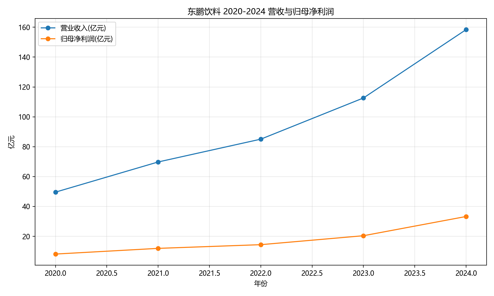
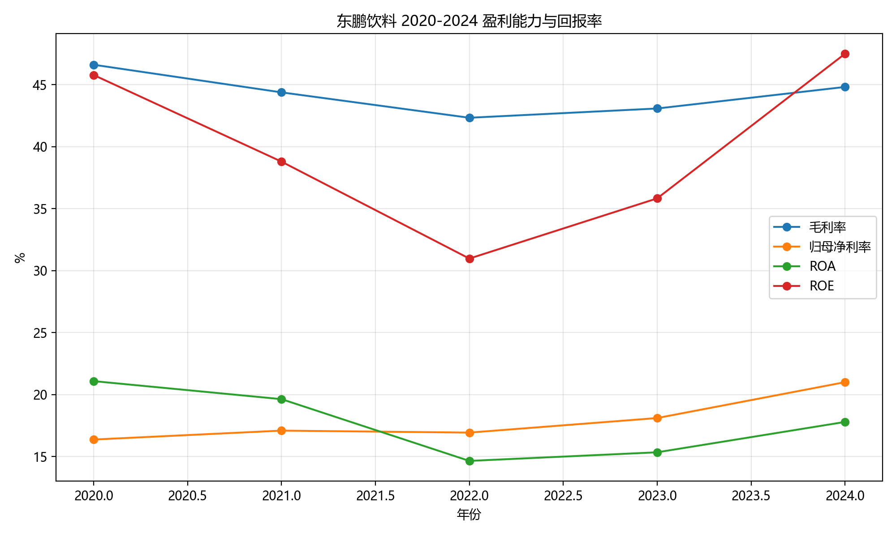
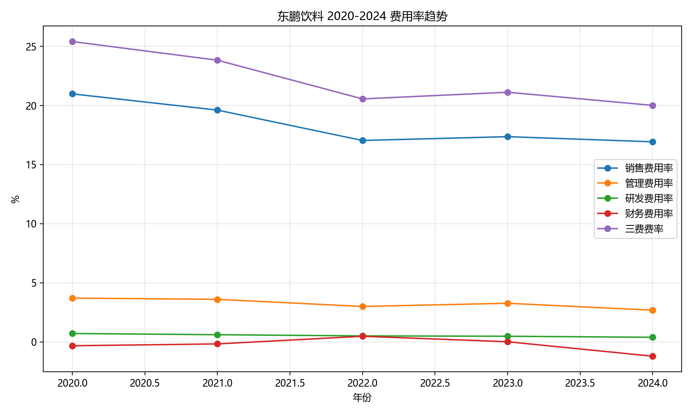
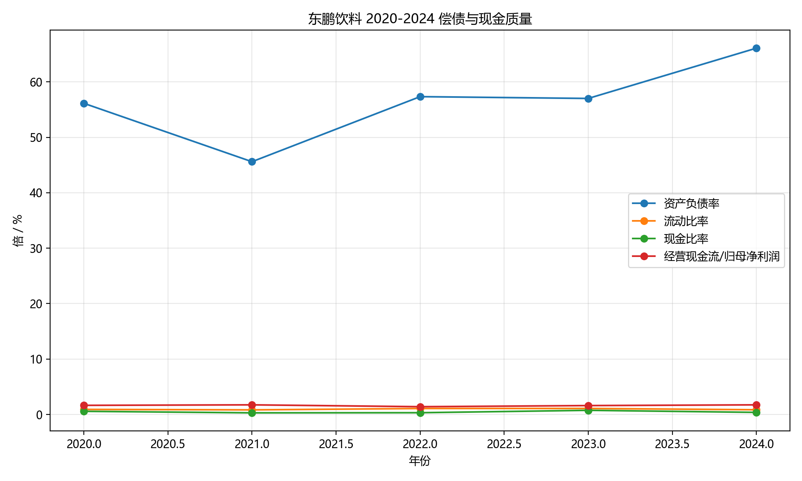

# 东鹏饮料 2020-2024 财务数据底表

## 口径说明

- 公司主体：东鹏饮料（集团）股份有限公司。
- 时间范围：2020-2024 共 5 个完整会计年度。
- 2020 年数据来自 A 股招股说明书中的经审计合并报表；2021-2024 年数据来自对应年度年报合并报表。
- 港股招股说明书已下载留档，但本版 5 年趋势主表未混入港股招股书中的 2025 年九个月口径，以避免年度与期间口径混杂。
- 截至 2026-04-06，未检索到东鹏饮料 2025 年年度报告正式 PDF 的官方披露链接，因此本版年报底表截至 2024 年。
- 三表金额展示单位为“亿元人民币”，CSV 明细保留原始“元”口径。
- ROA = 归母净利润 / 平均总资产；ROE = 归母净利润 / 平均归母权益。

## 已下载官方资料

| 资料         | 日期         | 用途                        | 本地路径                                |
|:-----------|:-----------|:--------------------------|:------------------------------------|
| A股招股说明书    | 2021-05-14 | A股招股书回溯的 2018-2020 审计财务报表 | raw/official/A股招股说明书_2021-05-14.pdf |
| 2021 年年度报告 | 2022-02-28 | 2021 年合并报表                | raw/official/2021年年度报告.pdf          |
| 2022 年年度报告 | 2023-04-22 | 2022 年合并报表                | raw/official/2022年年度报告.pdf          |
| 2023 年年度报告 | 2024-04-15 | 2023 年合并报表                | raw/official/2023年年度报告.pdf          |
| 2024 年年度报告 | 2025-03-08 | 2024 年合并报表                | raw/official/2024年年度报告.pdf          |
| 港股招股说明书    | 2026-01-26 | 港股 IPO 招股说明书，已下载留档        | raw/official/港股招股说明书_2026-01-26.pdf |

## 合并资产负债表

| 项目          | 2020   |   2021 |   2022 |   2023 |   2024 |
|:------------|:-------|-------:|-------:|-------:|-------:|
| 货币资金        | 12.25  |  10.19 |  21.58 |  60.58 |  56.53 |
| 交易性金融资产     | 0.50   |   3.01 |  20.37 |  12.39 |  48.97 |
| 应收账款        | 0.13   |   0.25 |   0.25 |   0.66 |   0.81 |
| 预付款项        | 1.79   |   0.57 |   1.27 |   1.58 |   2.27 |
| 其他应收款       | 0.15   |   0.18 |   0.16 |   0.22 |   0.28 |
| 存货          | 2.73   |   3.4  |   3.94 |   5.69 |  10.68 |
| 一年内到期的非流动资产 | 0.80   |   9.86 |  16.55 |   4.2  |   1.84 |
| 其他流动资产      | 1.25   |   1.05 |   8.34 |   2.37 |   5.67 |
| 流动资产合计      | 19.59  |  28.52 |  72.46 |  87.69 | 127.06 |
| 债权投资        | 1.00   |   1.5  |   3.83 |  12.2  |  36.72 |
| 其他非流动金融资产   |        |  19.09 |   6.17 |   3.43 |   3.77 |
| 固定资产        | 14.04  |  19.09 |  22.32 |  29.16 |  36.7  |
| 在建工程        | 4.56   |   1.87 |   5.29 |   3.85 |   5.54 |
| 使用权资产       |        |   3.23 |   0.91 |   0.98 |   0.87 |
| 无形资产        | 2.37   |   3.23 |   3.57 |   4.85 |   7.46 |
| 长期待摊费用      | 0.25   |   0.24 |   0.28 |   0.33 |   0.55 |
| 递延所得税资产     | 1.34   |   1.8  |   3.21 |   3.59 |   4.6  |
| 其他非流动资产     | 0.47   |   1.38 |   0.65 |   1.03 |   3.5  |
| 非流动资产合计     | 24.02  |  49.39 |  46.23 |  59.41 |  99.71 |
| 资产总计        | 43.61  |  77.9  | 118.7  | 147.1  | 226.76 |
| 短期借款        | 1.10   |   6.24 |  31.82 |  29.96 |  65.51 |
| 应付票据        | 0.03   |   0.18 |   0.25 |   0.31 |   0.1  |
| 应付账款        | 2.95   |   5.36 |   6.26 |   8.84 |  12.55 |
| 合同负债        | 9.50   |  12.41 |  16.27 |  26.07 |  47.61 |
| 应付职工薪酬      | 1.04   |   1.69 |   1.79 |   2.84 |   4.15 |
| 应交税费        | 1.20   |   1.53 |   3.13 |   2.34 |   3.79 |
| 其他应付款       | 4.11   |   5.53 |   6.56 |   8.17 |  10.89 |
| 一年内到期的非流动负债 | 0.62   |   0.42 |   0.39 |   0.34 |   0.13 |
| 其他流动负债      | 0.75   |   0.79 |   0.58 |   1.6  |   3.72 |
| 流动负债合计      | 21.30  |  34.15 |  67.06 |  80.47 | 148.45 |
| 长期借款        | 3.02   |   0.26 |   0.85 |   0.95 |   0.85 |
| 租赁负债        |        |   0.13 |   0.85 |   0.95 |   0.85 |
| 递延收益        | 0.15   |   0.13 |   0.14 |   0.2  |   0.51 |
| 递延所得税负债     | 0.01   |   0.04 |   0.01 |   0.04 |   0.03 |
| 非流动负债合计     | 3.18   |   1.37 |   1    |   3.39 |   1.4  |
| 负债合计        | 24.48  |  35.52 |  68.05 |  83.86 | 149.85 |
| 股本          | 3.60   |   4    |   4    |   4    |   5.2  |
| 资本公积        | 3.88   |  20.8  |  20.8  |  20.8  |  19.6  |
| 其他综合收益      | 0.00   |   0    |  -0.14 |   0.05 |   0.42 |
| 盈余公积        | 1.12   |   2    |   2    |   2    |   2.6  |
| 未分配利润       | 10.52  |  15.58 |  23.98 |  36.38 |  49.05 |
| 归母权益合计      | 19.13  |  42.38 |  50.64 |  63.24 |  76.88 |
| 少数股东权益      | 0.00   |   0    |   0    |   0    |   0.04 |
| 权益合计        | 19.13  |  42.38 |  50.64 |  63.24 |  76.92 |

## 合并利润表

| 项目       |   2020 |   2021 |    2022 |     2023 |     2024 |
|:---------|-------:|-------:|--------:|---------:|---------:|
| 营业收入     |  49.59 | 69.78  | 85.05   | 112.63   | 158.39   |
| 营业成本     |  26.48 | 38.82  | 49.05   |  64.12   |  87.42   |
| 税金及附加    |   0.5  |  0.77  |  0.93   |   1.21   |   1.6    |
| 销售费用     |  10.4  | 13.68  | 14.49   |  19.56   |  26.81   |
| 管理费用     |   1.84 |  2.52  |  2.56   |   3.69   |   4.26   |
| 研发费用     |   0.36 |  0.43  |  0.44   |   0.54   |   0.63   |
| 财务费用     |  -0.16 | -0.11  |  0.41   |   0.02   |  -1.91   |
| 其他收益     |   0.23 |  0.21  |  0.56   |   0.7    |   0.59   |
| 投资收益     |   0.1  |  0.23  |  0.7    |   1.42   |   0.95   |
| 营业利润     |  10.5  | 15.29  | 18.54   |  25.88   |  41.45   |
| 营业外收入    |   0.02 |  0.02  |  0.02   |   0.02   |   0.02   |
| 营业外支出    |   0.23 |  0.17  |  0.21   |   0.11   |   0.4    |
| 利润总额     |  10.3  | 15.14  | 18.36   |  25.79   |  41.07   |
| 所得税费用    |   2.17 |  3.21  |  3.95   |   5.39   |   7.81   |
| 净利润      |   8.12 | 11.93  | 14.41   |  20.4    |  33.26   |
| 归母净利润    |   8.12 | 11.93  | 14.41   |  20.4    |  33.27   |
| 少数股东损益   |   0    |  0     |  0      |   0      |  -0      |
| 综合收益总额   |   0    | 11.93  | 14.26   |  20.59   |  33.64   |
| 归母综合收益总额 |   8.12 | 11.93  | 14.26   |  20.59   |  33.64   |
| 基本每股收益   |   2.26 |  3.112 |  3.6012 |   5.0993 |   6.3974 |
| 稀释每股收益   |   2.26 |  3.112 |  3.6012 |   5.0993 |   6.3974 |

## 合并现金流量表

| 项目             |   2020 |   2021 |   2022 |   2023 |   2024 |
|:---------------|-------:|-------:|-------:|-------:|-------:|
| 销售商品提供劳务收到的现金  |  62.69 |  83.59 | 101.41 | 139    | 204.3  |
| 收到的税费返还        |   0.02 |   0.33 |   0.23 |   0.13 |   0.44 |
| 收到其他与经营活动有关的现金 |   0.6  |   0.59 |   0.97 |   1.45 |   1.82 |
| 经营活动现金流入小计     |  63.31 |  84.52 | 102.6  | 140.57 | 206.57 |
| 购买商品接受劳务支付的现金  |  29.41 |  38.13 |  52.37 |  68.2  |  96.11 |
| 支付给职工及为职工支付的现金 |   6.94 |   8.9  |  10.51 |  12.71 |  16    |
| 支付的各项税费        |   6.52 |   8.6  |  11.04 |  15.37 |  19.89 |
| 支付其他与经营活动有关的现金 |   7.04 |   8.12 |   8.42 |  11.48 |  16.68 |
| 经营活动现金流量净额     |  13.4  |  20.77 |  20.26 |  32.81 |  57.89 |
| 收回投资收到的现金      |   8.3  |  18    |  35.97 |  91.13 | 141.73 |
| 取得投资收益收到的现金    |   0.1  |   0.19 |   0.66 |   2.08 |   1.92 |
| 投资活动现金流入小计     |   8.43 |  18.29 |  36.7  |  93.38 | 143.68 |
| 购建长期资产支付的现金    |   6.45 |   6.09 |   7.93 |   9.18 |  16.87 |
| 投资支付的现金        |   9.7  |  47.77 |  62.07 |  91.73 | 195.56 |
| 投资活动现金流量净额     |  -7.73 | -35.63 | -33.36 |  -7.58 | -68.75 |
| 吸收投资收到的现金      |   0    |  18.51 |   0    |   0    |   0.04 |
| 取得借款收到的现金      |   5.24 |   6.38 |  34.5  |  59.09 |  92.8  |
| 分配股利及偿付利息支付的现金 |   5.56 |   6.27 |   6.03 |   8.11 |  20.51 |
| 筹资活动现金流量净额     |  -3.34 |  13.07 |  17.64 | -10.58 |  15.07 |
| 汇率变动影响         |   0    |   0    |  -0.15 |  -0.29 |   0.32 |
| 现金净增加额         |   2.34 |  -1.8  |   4.39 |  14.37 |   4.53 |
| 期初现金及现金等价物余额   |   9.45 |  11.79 |   9.99 |  14.39 |  28.75 |
| 期末现金及现金等价物余额   |  11.79 |   9.99 |  14.39 |  28.75 |  33.28 |

## 关键财务指标

|   年份 |   营业收入 |    毛利 |   归母净利润 |   经营活动现金流量净额 |   购建长期资产支付的现金 |    总资产 |    总负债 |   归母权益 | 毛利率    | 归母净利率   | 销售费用率   | 管理费用率   | 研发费用率   | 财务费用率   | 三费费率   | ROA    | ROE    | 资产负债率   |   流动比率 |   现金比率 |   经营现金流/归母净利润 |   资本开支/收入 |
|-----:|-------:|------:|--------:|-------------:|--------------:|-------:|-------:|-------:|:-------|:--------|:--------|:--------|:--------|:--------|:-------|:-------|:-------|:--------|-------:|-------:|--------------:|----------:|
| 2020 |  49.59 | 23.11 |    8.12 |        13.4  |          6.45 |  43.61 |  24.48 |  19.13 | 46.60% | 16.38%  | 20.98%  | 3.71%   | 0.72%   | -0.32%  | 25.41% | 21.09% | 45.77% | 56.13%  |   0.92 |   0.58 |          1.65 |      0.13 |
| 2021 |  69.78 | 30.96 |   11.93 |        20.77 |          6.09 |  77.9  |  35.52 |  42.38 | 44.37% | 17.10%  | 19.61%  | 3.61%   | 0.61%   | -0.16%  | 23.83% | 19.63% | 38.79% | 45.60%  |   0.83 |   0.3  |          1.74 |      0.09 |
| 2022 |  85.05 | 36    |   14.41 |        20.26 |          7.93 | 118.7  |  68.05 |  50.64 | 42.33% | 16.94%  | 17.04%  | 3.00%   | 0.51%   | 0.48%   | 20.56% | 14.65% | 30.97% | 57.33%  |   1.08 |   0.32 |          1.41 |      0.09 |
| 2023 | 112.63 | 48.51 |   20.4  |        32.81 |          9.18 | 147.1  |  83.86 |  63.24 | 43.07% | 18.11%  | 17.36%  | 3.27%   | 0.48%   | 0.02%   | 21.12% | 15.35% | 35.82% | 57.01%  |   1.09 |   0.75 |          1.61 |      0.08 |
| 2024 | 158.39 | 70.97 |   33.27 |        57.89 |         16.87 | 226.76 | 149.85 |  76.88 | 44.81% | 21.00%  | 16.93%  | 2.69%   | 0.40%   | -1.20%  | 20.01% | 17.80% | 47.49% | 66.08%  |   0.86 |   0.38 |          1.74 |      0.11 |

## 图表

### 营收与归母净利润

### 盈利能力与回报率

### 费用率趋势

### 偿债与现金质量

