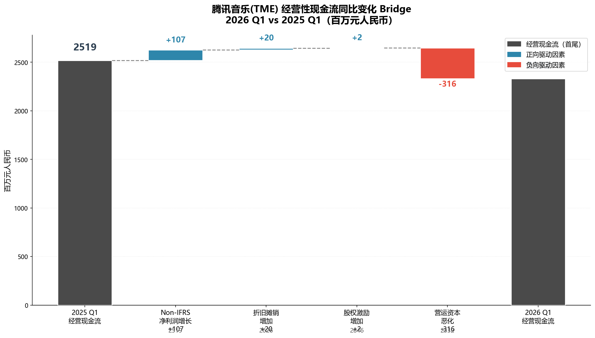

# 腾讯音乐(TME) 2026年Q1经营性现金流Bridge分析

> 数据来源：SEC EDGAR Form 6-K (Filed May 12, 2026) | 下载时间：2026-05-12

---

## 1. 已下载的财报原文文件

| 文件 | 说明 | 路径 |
|------|------|------|
| `TME_1Q26_英文版_业绩公告.pdf` | 英文版PDF | `2026Q1_季报原文/` |
| `TME_1Q26_中文版_业绩公告.pdf` | 中文版PDF | `2026Q1_季报原文/` |
| `TME_2026Q1_Earnings_Ex99.1.htm` | SEC Exhibit 99.1 新闻稿原文 | `2026Q1_季报原文/` |
| `TME_2026Q1_Earnings_Full.txt` | SEC 6-K 完整提交文本 | `2026Q1_季报原文/` |

---

## 2. 利润表

单位：百万元人民币（除每股数据外）

| 项目 | Q1 2025 | Q1 2026 | 同比变化 |
|------|--------:|--------:|--------:|
| 音乐相关服务收入 | 5,804 | 6,514 | +12.2% |
| 社交娱乐及其他收入 | 1,552 | 1,381 | -11.0% |
| **总收入** | **7,356** | **7,895** | **+7.3%** |
| 营业成本 | (4,114) | (4,349) | +5.7% |
| **毛利润** | **3,242** | **3,546** | **+9.4%** |
| 毛利率 | 44.1% | 44.9% | +0.8pp |
| 销售费用 | (199) | (271) | +36.2% |
| 管理费用 | (944) | (940) | -0.4% |
| 营业费用合计 | (1,143) | (1,211) | +5.9% |
| 利息收入 | 297 | 246 | -17.2% |
| 其他收益净额 | 2,440 | 66 | -97.3% |
| **营业利润** | **4,836** | **2,647** | **-45.3%** |
| 权益法投资损益 | 23 | (7) | — |
| 财务成本 | (25) | (46) | +84.0% |
| 税前利润 | 4,834 | 2,594 | -46.3% |
| 所得税费用 | (446) | (457) | +2.5% |
| **期间利润** | **4,388** | **2,137** | **-51.3%** |
| 归母净利润 | 4,291 | 2,091 | -51.3% |
| 非控股权益 | 97 | 46 | -52.6% |

> IFRS 归母净利润下降 51.3%，主因 2025 Q1 含 23.7 亿元视同处置联营公司的一次性收益。

---

## 3. Non-IFRS 调节表

单位：百万元人民币

| 项目 | Q1 2025 | Q1 2026 | 同比变化 |
|------|--------:|--------:|--------:|
| IFRS 期间利润 | 4,388 | 2,137 | -51.3% |
| + 收购无形资产摊销 | 105 | 89 | -15.2% |
| + 股权激励 (SBC) | 161 | 163 | +1.2% |
| - 投资收益（视同处置等） | (2,375) | (2) | -99.9% |
| +/- 所得税影响 | (53) | (54) | +1.9% |
| **Non-IFRS 净利润（总）** | **2,226** | **2,333** | **+4.8%** |
| 归母 Non-IFRS 净利润 | 2,124 | 2,273 | +7.0% |
| 非控股权益 Non-IFRS | 102 | 60 | -41.2% |

---

## 4. 现金流量表

单位：百万元人民币

| 项目 | Q1 2025 | Q1 2026 | 同比变化 |
|------|--------:|--------:|--------:|
| **经营活动现金流** | **2,519** | **2,332** | **-7.4%** |
| 投资活动现金流 | (3,221) | 6,650 | — |
| 融资活动现金流 | (456) | 1,011 | — |
| 现金净变动额 | (1,158) | 9,993 | — |
| 期初现金余额 | 13,164 | 8,470 | -35.7% |
| 汇率影响 | 16 | (47) | — |
| 期末现金余额 | 12,022 | 18,416 | +53.2% |

> 期末现金及现金等价物 184.16 亿元；含定期存款和短期投资合计 **410.00 亿元**。

---

## 5. Adjusted EBITDA 调节表

单位：百万元人民币

| 项目 | Q1 2025 | Q1 2026 | 同比变化 |
|------|--------:|--------:|--------:|
| 期间利润 | 4,388 | 2,137 | -51.3% |
| + 所得税费用 | 446 | 457 | +2.5% |
| + 财务成本 | 25 | 46 | +84.0% |
| +/- 权益法投资损益 | (23) | 7 | — |
| = 营业利润 | 4,836 | 2,647 | -45.3% |
| - 其他收益净额 | (2,440) | (66) | -97.3% |
| - 利息收入 | (297) | (246) | -17.2% |
| + 折旧（PP&E + ROU） | 38 | 35 | -7.9% |
| + 无形资产摊销 | 275 | 298 | +8.4% |
| = **Adjusted EBITDA（含SBC）** | **2,412** | **2,668** | **+10.6%** |
| + 股权激励 (SBC) | 150 | 163 | +8.7% |
| = **Adjusted EBITDA** | **2,562** | **2,831** | **+10.5%** |

---

## 6. 经营性现金流 Bridge 分析

### 6.1 瀑布图



### 6.2 核心 Bridge 数据

从 **2025 Q1 OCF = 25.19亿** 到 **2026 Q1 OCF = 23.32亿** 的同比变化拆解：

```
2025 Q1 经营现金流:                             2,519 百万
  + Non-IFRS 净利润增长:                         +107  (2,226→2,333)
  + 折旧摊销增加:                                +20   (313→333)
  + 股权激励增加:                                 +2   (161→163)
  - 营运资本恶化:                               -316  (流出181→流出497)
═══════════════════════════════════════════════════════
2026 Q1 经营现金流:                             2,332 百万  (-7.4%)
```

**公式验证：** 2,519 + 107 + 20 + 2 - 316 = 2,332 ✓

| 项目 | 金额（百万） | 说明 |
|------|-----------:|------|
| 2025 Q1 OCF | 2,519 | 基准期 |
| + Non-IFRS 净利润增长 | +107 | 总净利润 2,226→2,333；归母口径 2,124→2,273 |
| + 折旧摊销增加 | +20 | D&A 313→333，主因无形资产摊销增加 |
| + 股权激励增加 | +2 | SBC 161→163，基本持平 |
| - 营运资本恶化 | **-316** | **核心原因**：流出181→流出497，多流出3.16亿 |
| **= 2026 Q1 OCF** | **2,332** | **同比下降 7.4%** |

### 6.3 从 Non-IFRS 净利润到 OCF 的转化率

| | Q1 2025 | Q1 2026 |
|--|--------:|--------:|
| Non-IFRS 净利润（总） | 2,226 | 2,333 |
| + D&A | 313 | 333 |
| + SBC | 161 | 163 |
| - 营运资本占用 | (181) | (497) |
| = **经营现金流** | **2,519** | **2,332** |
| **OCF / Non-IFRS 净利润** | **1.13x** | **1.00x** |

---

## 7. 原因深度分析

### 核心矛盾：利润增长但现金流下降

2026 Q1 Non-IFRS 归母净利润同比 +7.0%（22.73亿 vs 21.24亿），但经营现金流同比 -7.4%（23.32亿 vs 25.19亿）。利润与现金流的背离完全由营运资本恶化（同比多流出 3.16 亿）驱动。

### 营运资本恶化的四重因素

**① 内容预付款增加（最主要）**
公司与 JVR Music（周杰伦）、Linfair Records、MOK-A-BYE BABY MUSIC 等续签版权合作，深化 TF Entertainment 战略合作（30天提前发行窗口），预付版权金支出大幅增加。同时 AI 生成歌曲、自制 IP 等持续投入也占用营运资金。

**② 应收账款随非会员业务爆发而增加**
非会员服务收入同比 +28%（线下演出三位数增长、广告、Fan Club），带来更多应收账款。线下演出（BABYMONSTER、NCT WISH、汪苏泷等）的收款周期通常比会员订阅更长。

**③ 社交娱乐持续收缩**
社交娱乐收入同比 -11%，连续多季下滑，可能带来递延收入/合同负债减少，对营运资本产生负向影响。

**④ 应付款项节奏**
向版权方/内容方的付款节奏可能加快。2025年4月支付的 3.7 亿美元股息反映在融资活动中，不直接影响 OCF。

### 质量评估

| 维度 | 评价 |
|------|------|
| OCF / Non-IFRS 净利 | 1.00x（2025 Q1 为 1.13x），仍可覆盖，但效率下降 |
| 现金余额 | 184.16 亿（含存款合计 410 亿），流动性充裕 |
| 归母净利现金含量 | 23.32亿 OCF / 20.91亿 IFRS 净利 = 1.12x |
| 风险等级 | 低（营运资本波动属业务扩张的正常伴随现象） |

---

## 8. 总结

腾讯音乐 2026 Q1 经营现金流 23.32 亿元，同比下降 7.4%（减少 1.87 亿元）。核心矛盾在于 **Non-IFRS 净利润增长 7%，但营运资本同比多流出 3.16 亿元**，与公司加大内容投资版权续签+线下演出扩张）带来的预付和应收账款增加直接相关。

OCF/Non-IFRS 净利润转化率从 1.13x 降至 1.00x，现金生成能力依然健康但效率有所下降。公司期末现金 184.16 亿元（含存款合计 410 亿元），短期波动不构成流动性风险。后续关注内容预付款的摊销节奏和应收账款回收情况。
